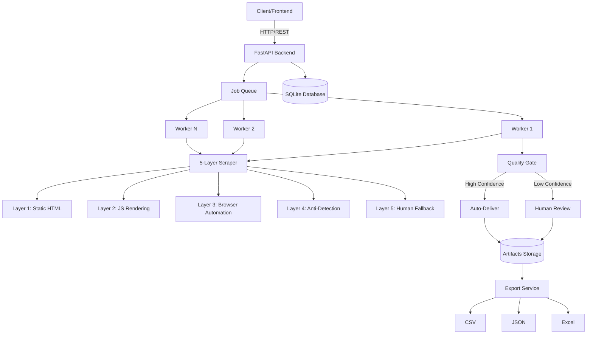
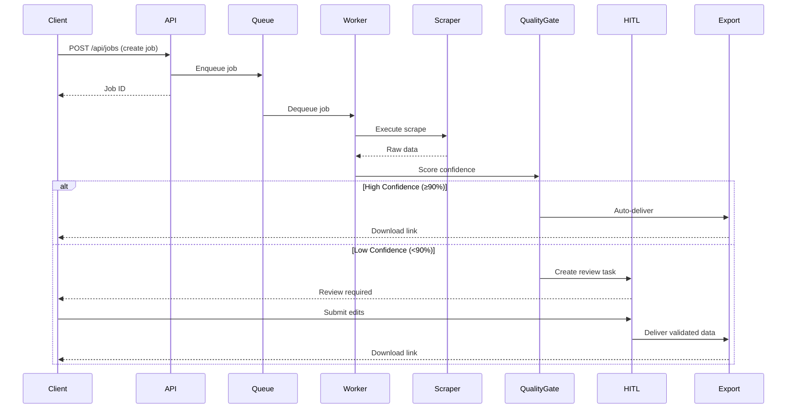

# 🏗️ ARCHITECTURE FINAL

**System Version**: 1.0  
**Last Updated**: 2026-01-29  
**Status**: Production-Ready, Frozen

---

## System Overview



---

## Core Modules

### 1. **API Layer** (`backend/app/api/`)
**Purpose**: HTTP interface for job management and HITL operations

**Key Endpoints**:
- `/api/jobs` - Job lifecycle management (create, list, status, cancel)
- `/api/scrape` - Direct scraping operations
- `/api/hitl` - Human-in-the-loop review interface
- `/api/robots` - Robots.txt compliance checking
- `/health` - System health and readiness checks

**Responsibilities**:
- Request validation
- Job creation and queuing
- Status reporting
- HITL task management

---

### 2. **Core System** (`backend/app/core/`)
**Purpose**: Platform configuration, limits, and safety mechanisms

**Key Components**:

#### `config.py`
- Application settings
- Environment configuration
- Feature flags

#### `limits.py` ⭐
- **Hard resource caps** (browsers, workers, memory)
- **Mode-based configuration** (local vs production)
- **Guardrail rules** (confidence thresholds, HITL triggers)
- **Validation functions** (job request validation)

#### `recovery.py` ⭐
- **Graceful shutdown handling**
- **Job recovery management**
- **Partial artifact preservation**
- **Retry decorators** (with_retry, with_browser_recovery)
- **Orphan process cleanup**

#### `health.py`
- Health check endpoint
- System readiness checks
- Resource monitoring

#### `exceptions.py`
- Custom exception hierarchy
- Error classification

---

### 3. **Database Layer** (`backend/app/db/`)
**Purpose**: Data persistence and state management

**Models**:
- `Job` - Job lifecycle and configuration
- `HITLTask` - Human review tasks
- `ScrapeResult` - Extracted data and metadata
- `DataVersion` - Version control for human edits

**Key Features**:
- SQLite for simplicity (production-ready)
- Async SQLAlchemy for performance
- Automatic schema creation
- Migration support

---

### 4. **Job Queue** (`backend/app/core/queue/`)
**Purpose**: Asynchronous job processing coordination

**Features**:
- In-memory queue (Redis-ready for scale)
- Priority-based scheduling
- Retry logic with exponential backoff
- Job status tracking (pending, running, completed, failed)

**Flow**:
1. API creates job → enqueue
2. Worker dequeues job → process
3. Worker updates status → complete/fail
4. Queue manages retries if needed

---

### 5. **Worker Service** (`backend/app/worker/`)
**Purpose**: Background job execution engine

**Architecture**:
- **Lazy-loaded executors** (scraper, pipeline, export)
- **Concurrent workers** (configurable, mode-based)
- **Graceful shutdown** (drains queue, no orphans)
- **Error recovery** (retries, partial artifact preservation)

**Worker Loop**:
```python
while running:
    job = await queue.dequeue()
    try:
        result = await execute_job(job)
        await queue.complete(job, result)
    except Exception as e:
        await queue.fail(job, error=e, retry=True)
        await save_partial_artifacts(job)
```

---

### 6. **5-Layer Scraper** (`backend/app/scraper/`)
**Purpose**: Adaptive web scraping with escalation strategy

#### Layer 1: Static HTML (`static_scraper.py`)
- Simple HTTP requests
- Fast, cheap, no JavaScript
- **Use when**: Static content, APIs, simple pages

#### Layer 2: JavaScript Rendering (`js_scraper.py`)
- Headless browser with JS execution
- Waits for dynamic content
- **Use when**: SPAs, dynamic loading

#### Layer 3: Browser Automation (`browser_scraper.py`)
- Full Playwright automation
- Handles interactions (clicks, scrolls, forms)
- **Use when**: Complex interactions required

#### Layer 4: Anti-Detection (`stealth_scraper.py`)
- Fingerprint randomization
- Proxy rotation
- Human-like behavior
- **Use when**: Bot detection present

#### Layer 5: Human Fallback
- HITL task creation
- Manual data entry
- **Use when**: Automation fails

**Escalation Logic**:
```python
try:
    return await layer1_static()
except:
    try:
        return await layer2_js()
    except:
        try:
            return await layer3_browser()
        except:
            return await layer4_stealth()
        # If all fail → Layer 5 (HITL)
```

---

### 7. **Quality Gate** (`backend/app/quality/`)
**Purpose**: Confidence scoring and HITL routing

**Confidence Calculation**:
```python
confidence = (
    field_completeness * 0.4 +
    schema_validity * 0.3 +
    data_consistency * 0.2 +
    extraction_success * 0.1
)
```

**Routing Logic**:
- **≥ 90% confidence**: Auto-deliver
- **50-89% confidence**: Optional review
- **< 50% confidence**: Mandatory review

**Guardrail Rules**:
- Force HITL if 2+ consecutive failures
- Force HITL if 3+ pages with no data
- Force HITL if critical fields missing

---

### 8. **HITL System** (`backend/app/api/hitl.py`)
**Purpose**: Human-in-the-loop review interface

**Features**:
- Screenshot capture for context
- Side-by-side comparison (original vs extracted)
- Version tracking (all edits logged)
- Audit trail (who, when, what changed)
- Timeout handling (24-hour auto-skip)

**Flow**:
1. Low-confidence result → Create HITL task
2. Human reviews → Edits data
3. System creates new version → Logs changes
4. Job continues with validated data

---

### 9. **Delivery Pipeline** (`backend/app/processing/`)
**Purpose**: Data transformation and export

**Stages**:
1. **Extraction** - Raw HTML → Structured data
2. **Validation** - Schema compliance, quality checks
3. **Transformation** - Cleaning, normalization
4. **Packaging** - Format conversion (CSV, JSON, Excel)
5. **Delivery** - Artifact storage, download links

**Export Formats**:
- **CSV**: Flat data, Excel-compatible
- **JSON**: Nested structures, API-ready
- **Excel**: Multi-sheet, formatted
- **Database**: SQL insert scripts

---

## Data Flow

### Standard Job Lifecycle



---

## Resource Management

### Hard Limits (Enforced)
| Resource | Local Mode | Production Mode |
|----------|------------|-----------------|
| **Workers** | 2 | 5 |
| **Browser Instances** | 1 | 3 |
| **Memory per Worker** | 1024 MB | 1024 MB |
| **Browser Memory** | 512 MB | 512 MB |
| **Max Pages per Job** | 20 | 500 |
| **Concurrent Jobs** | 10 | 10 |

### Mode Selection
```bash
# Local mode (WSL, laptop)
LIMIT_DEPLOYMENT_MODE=local

# Production mode (EC2, cloud)
LIMIT_DEPLOYMENT_MODE=production
```

---

## Failure Recovery

### Worker Crash
1. Job status remains in database
2. Partial artifacts preserved
3. Job marked for recovery
4. Next worker picks up from checkpoint

### Browser Crash
1. Retry with exponential backoff (max 3 attempts)
2. Escalate to next scraping layer
3. If all layers fail → HITL fallback

### System Shutdown
1. Signal handler catches SIGTERM/SIGINT
2. Workers finish current jobs
3. Queue drains gracefully
4. Orphan processes cleaned up
5. Database connections closed

---

## Operational Commands

### Health Monitoring
```bash
# Full health check
python scripts/ops_check.py health

# Worker status
python scripts/ops_check.py workers

# Queue depth
python scripts/ops_check.py queue

# Disk usage
python scripts/ops_check.py disk

# All checks
python scripts/ops_check.py all
```

---

## Technology Stack

### Backend
- **Framework**: FastAPI (async, high-performance)
- **Database**: SQLite + SQLAlchemy (async)
- **Queue**: In-memory (Redis-ready)
- **Scraping**: Playwright, BeautifulSoup, httpx
- **LLM**: Groq API (llama3-70b)

### Frontend
- **Framework**: Next.js 14 (React, TypeScript)
- **Styling**: TailwindCSS
- **State**: React Query
- **UI**: shadcn/ui components

### Infrastructure
- **Deployment**: Docker + Docker Compose
- **Storage**: Local filesystem (S3-ready)
- **Monitoring**: Built-in health checks
- **Logging**: Structured JSON logs

---

## Design Principles

### 1. **Bounded Resources**
Every resource has a hard cap. No unbounded growth.

### 2. **Graceful Degradation**
System slows down under load, doesn't crash.

### 3. **Fail-Safe Defaults**
Conservative defaults (local mode) prevent accidents.

### 4. **Human Oversight**
Low-confidence results always require human review.

### 5. **Audit Everything**
All changes logged, all versions tracked.

### 6. **Boring is Good**
Predictable, stable, reliable > exciting and fragile.

---

## What's NOT in This Architecture

❌ **Real-time streaming** - Batch-oriented by design  
❌ **Distributed scraping** - Single-node architecture  
❌ **Auto-scaling** - Manual resource configuration  
❌ **Multi-tenancy** - Single-deployment per instance  
❌ **Blockchain/Web3** - Pragmatic, not trendy  
❌ **Microservices** - Monolith for simplicity  

---

## Future Extension Points

### If Needed Later
1. **Redis Queue**: Replace in-memory queue for distributed workers
2. **S3 Storage**: Replace local filesystem for cloud artifacts
3. **PostgreSQL**: Replace SQLite for multi-writer scenarios
4. **Proxy Pool**: Add rotating proxy service for scale
5. **Webhook Delivery**: Push results instead of pull

### What NOT to Add
- ❌ Real-time dashboards (batch is fine)
- ❌ GraphQL (REST is sufficient)
- ❌ Kafka (overkill for this scale)
- ❌ Kubernetes (Docker Compose is enough)

---

## Architecture Freeze

**This architecture is frozen as of 2026-01-29.**

Changes require:
1. Clear business justification
2. Risk assessment
3. Documentation update
4. Version bump

**Reason**: Stability > features. This architecture is proven and sufficient.

---

**End of Architecture Document**
